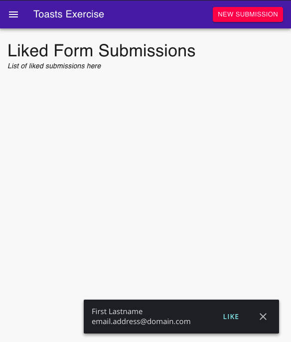

# Toast Exercise

Welcome to the toast exercise! We just got a new project from the Product team to implement
a simple toast system that notifies users when someone fills out a form on a page they've published (a form submission).
They then can "like" the submission to have it saved on their list.

Our hope is this exercise should take around 2-4 hours.

_Please do not spend more than 4 hours._ If you do not finish, that is fine. We are
most concerned with discussing how you approached the problem and solution during the
interview.

## Setup

* Must have recent versions of `git` installed
* Must use node 16
* Use any editor or other tools

Once you have the files on your computer (after unzipping), run:

```shell
git init
npm install
npm start
```

## Exercise Overview

Take some time to familiarize yourself with this code. This was bootstrapped with `create-react-app`
and it's instructions are below if you need them.

## Requirements

* Commit often with messages to "document" your thought process and work. The more the better!
* DO NOT remove any dependencies
* DO NOT modify `src/service/mockServer.js`
* You MUST use React for your primary UI development
* You MAY add any dependency to help you
* You MAY use any CSS framework you'd like.
  * The project is scaffolded using [MUI's style system](https://mui.com/system/basics/), but is not a requirement to use.
* You MAY choose any method to store UI state
* AVOID editing `public/index.html`. Exceptions made for CSS frameworks.
* Your app MUST run with `npm start`
* (Bonus) Passing tests with `npm test`

This project is setup to import standard `.css` files:

```js
import './my-styles.css'
```

This way, you don't have to edit the `index.html` file.

### Mock Server

A "server" is provided. Its API is detailed below.

`src/service/mockServer.js` has a few functions you will need to use.

`onMessage(callback)` is used to register a callback for when we get a new form submission from
our server. In this example, new form submissions are delivered when you hit the "New Submission"
button in the header.

`saveLikedFormSubmission(formSubmission)` saves the submission to our "server" (localstorage). To update
a submission, you pass a full submission with the values updated. We have a flaky connection
to our database that can sometimes fail.

`fetchLikedFormSubmissions()` "fetches" the form submissions that have been liked (updated by you).
This also tends to be slow and fail at times.

## Feature Requirements

We want to have toasts show up whenever we receive a message from the server that a new client just
signed up! It should look like something like:



It doesn't have to look exact.

### Requirements

* When you click "New Submission" your app must respond and show a toast
* Toasts that are "liked" are added to the list on the page
* Toasts that are dismissed are removed and you never see them again
* When you refresh the browser, the list must persist.
* (Bonus) Any level of polish you think would make for a good UX

### Hints

* Focus on getting the core requirements down first. Then work on polish if you have time
* If you use MUI, they have a `<Snackbar>` component that can be helpful.

## Submitting

Please submit your code, with commit messages, to a public git repository and reply to
the recruiting emails with the link to your repository.

------------------------

Create React App README
================

This project was bootstrapped with [Create React App](https://github.com/facebook/create-react-app).

## Available Scripts

In the project directory, you can run:

### `npm start`

Runs the app in the development mode.
Open [http://localhost:3000](http://localhost:3000) to view it in the browser.

The page will reload if you make edits.
You will also see any lint errors in the console.

### `npm test`

Launches the test runner in the interactive watch mode.
See the section about [running tests](https://facebook.github.io/create-react-app/docs/running-tests) for more information.

## Learn More


You can learn more in the [Create React App documentation](https://facebook.github.io/create-react-app/docs/getting-started).

To learn React, check out the [React documentation](https://reactjs.org/).

## Challenge Development Process Documentation 

### Initial Reaction
When I saw that I had to use React for this challenge, my heart dropped. Frontend development is not my main focus, and I knew I would spend a significant amount of time researching and googling to complete this task.

### Research and Setup
I started by reading the instructions carefully and writing down every concept I didn't understand. Although I am familiar with the general concepts and flow, I had to ensure the setup was correct and look up JavaScript syntax. I encountered an issue where the package.json file wasn't being read properly, but a clean installation and setup resolved this.

### Initial Implementation
I began by working on the Toast.js component. This part required the most research as I had to reverse engineer functions from various sources to fit my needs. I also used GitHub Copilot for minor debugging since JavaScript and React syntax were taking me a long time.

### Debugging and Errors
My first attempt was riddled with issues. I encountered multiple uncaught runtime errors related to type mismatches, which took time to diagnose and fix. There were moments of panic and despair as I struggled to make progress and understand the source of the errors. It was really frustrating particularly when I did not seem to understand where the error was coming from despite looking through the documentation and examples. After finding a post on StackOverflow addressing a similar issue, I noticed that the main issue was how 'Header', 'Content', and 'Toast' were being exported.

Then, I verified that these components were imported correctly in App.js using default import syntax without curly braces. This addressed the issue of React receiving an object instead of a valid component type, which resolved the errors and allowed the application to render properly. This is what led to doing the challenge in its most rudimentary form, but at least the functionality seemed to work as expected.

### Learning and Progress
Despite the initial challenges, I kept pushing forward. Running npm test showed that tests were passing, but I still faced issues in the local server. This discrepancy highlighted my need to better understand the code and environment, and I realized most of my mistakes did not happen because of my logic, but because of my lack of familiarity with the tools. After several hours of tutorials and documentation, I was able to make significant progress. To be completely honest, since I started looking at this while I was still in class, I do not know how much time it took, but it might have been a little over the time limit. After all this time, and thoroughly familiarizing myself with the environment and code, I finally completed the challenge. Everything seemed to work as expected, and even though I felt a sense of accomplishment in overcoming the difficulties I still feel I need to work harder. 

Conclusion
This challenge was a valuable learning experience that pushed me out of my comfort zone. Despite my primary focus being on backend and AI, I was able to tackle a frontend challenge by leveraging documentation, tutorials, and debugging tools. Personally, I think this experience has not only challenged me to work using my weakest skillset, but strengthened my resolve to become a SWE.


